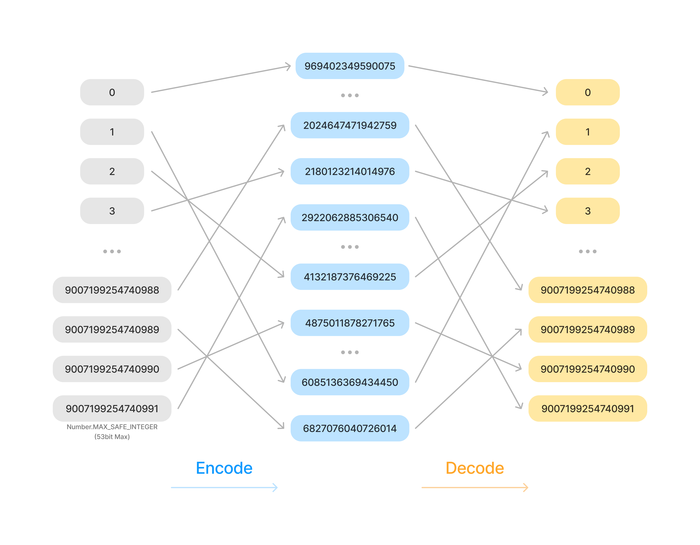

# inthash <a href="https://github.com/denostack"></a>

<p>
  <a href="https://github.com/denostack/inthash/actions"></a>
  <a href="https://codecov.io/gh/denostack/inthash"></a>
  
  
  <br />
  <a href="https://deno.land/x/inthash"></a>
  <a href="https://www.npmjs.com/package/inthash"></a>
  <a href="https://npmcharts.com/compare/inthash?minimal=true"></a>
</p>

inthash is a versatile library for generating integer hash values in Javascript
and Typescript using Knuth's multiplicative method. With a user-friendly
interface, this library allows you to obfuscate predictable numbers, making it
ideal for scenarios like 'Auto Increment' values in databases. inthash supports
`number`, `string`, `bigint`.

## Installation

**Node.js**

```bash
npm install inthash
```

**Deno**

```ts
import { Hasher } from "https://deno.land/x/inthash/mod.ts";
```

## Usage

### Generating Random Settings

Run the following command to generate random settings for your hasher:

```bash
# Node.js:
npx inthash

# Deno:
deno run https://deno.land/x/inthash/cli.ts

# Output:
# {
#   "bits": 53,
#   "prime": "6456111708547433",
#   "inverse": "3688000043513561",
#   "xor": "969402349590075"
# }
```

### Creating and Using a Hasher

Create a hasher with the generated settings:

```ts
const hasher = new Hasher({
  bits: 53, // Javascript, Number.MAX_SAFE_INTEGER
  prime: "6456111708547433", // Random Prime
  inverse: "3688000043513561", // Modular Inverse
  xor: "969402349590075", // Random n-bit xor mask
});

const encoded = hasher.encode(100); // result: 6432533451586367
const decoded = hasher.decode(encoded); // result: 100
```



```ts
// You can obfuscate predictable numbers like 'Auto Increment'!
hasher.encode(0); // 969402349590075
hasher.encode(1); // 6085136369434450
hasher.encode(2); // 4132187376469225
hasher.encode(3); // 2180123214014976

hasher.encode(Number.MAX_SAFE_INTEGER - 3); // 2024647471942759
hasher.encode(Number.MAX_SAFE_INTEGER - 2); // 6827076040726014
hasher.encode(Number.MAX_SAFE_INTEGER - 1); // 4875011878271765
hasher.encode(Number.MAX_SAFE_INTEGER); // 2922062885306540
```

inthash also supports `string` and `bigint` values:

```ts
// String input and output
const encoded = hasher.encode("100"); // "6432533451586367"
const decoded = hasher.decode(encoded); // "100"
```

```ts
// BigInt input and output
const encoded = hasher.encode(100n); // 6432533451586367n
const decoded = hasher.decode(encoded); // 100n
```

### Handling MySQL `bigint(20)`

To work with `bigint(20)` in MySQL, you need to handle 64-bit values. The old
version of IntHash supported up to 53-bit values
(`Number.MAX_SAFE_INTEGER === 2**53 - 1`). From v3 onwards, n-bit values are
supported:

```bash
# Node.js:
npx inthash -b64

# Deno:
deno run https://deno.land/x/inthash/cli.ts -b64

# Output:
# {
#   "bits": 64,
#   "prime": "16131139598801670337",
#   "inverse": "14287487925114175297",
#   "xor": "8502035541264656686"
# }
```

## See also

- [optimus](https://github.com/jenssegers/optimus) A PHP implementation of
  Knuth's multiplicative hashing method. inthash is inspired by and ported from
  this library.
