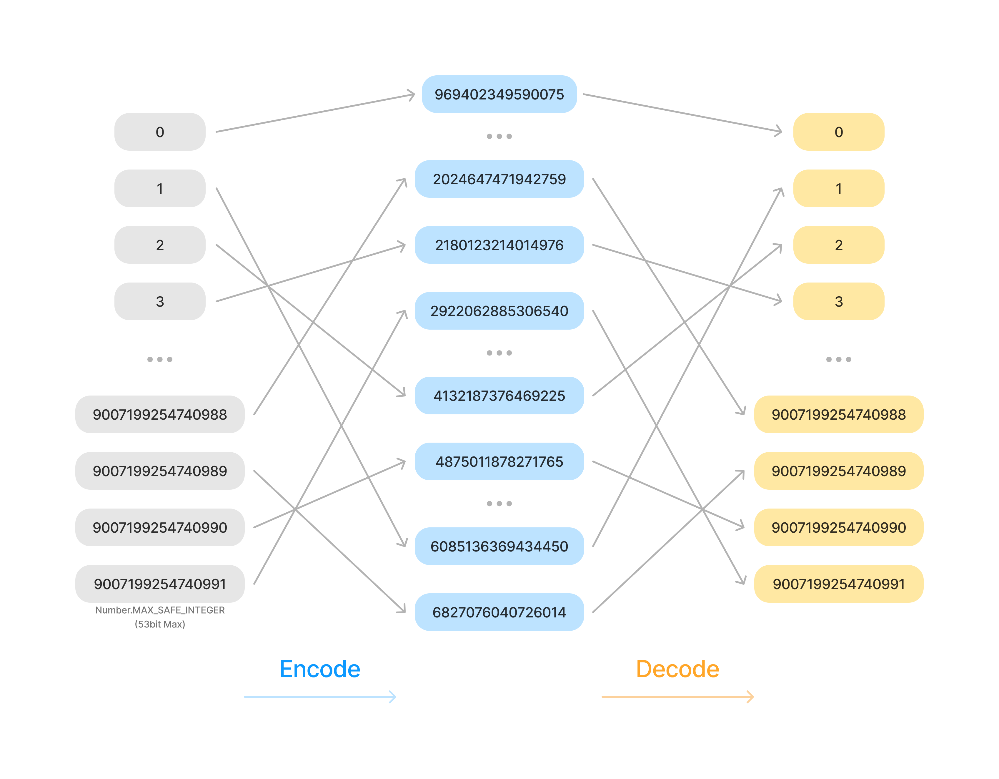

# bijector <a href="https://github.com/denostack"></a>

<p>
  <a href="https://github.com/denostack/bijector/actions"></a>
  <a href="https://codecov.io/gh/denostack/bijector"></a>
  
  
  <br />
  <a href="https://jsr.io/@denostack/bijector"></a>
  <a href="https://www.npmjs.com/package/bijector"></a>
  <a href="https://npmcharts.com/compare/bijector?minimal=true"></a>
</p>

> Renamed from [`inthash`](https://www.npmjs.com/package/inthash) in v4. The algorithm and parameter format are
> unchanged. See [Migration from `inthash`](#migration-from-inthash).

**bijector** is a reversible integer bijection for Javascript and Typescript. It maps an integer space onto itself with
a one-to-one correspondence, so every input has exactly one output and vice versa. Under the hood it uses Knuth's
multiplicative method over a modular ring (`prime`, modular `inverse`, and an `xor` mask), giving you a fast, lossless,
deterministic `encode` / `decode` pair.

Unlike a regular hash (one-way) or a random generator, `bijector` is **mathematically invertible** — the inverse is
guaranteed to exist because the transformation is a bijection on `[0, 2^bits)`.

## Use cases

- **Obfuscate auto-increment IDs** — expose `/users/6432533451586367` instead of `/users/100`
- **License / serial key generation** — turn a sequence counter into a random-looking key
- **URL shorteners** — deterministic public codes from internal row IDs
- **Coupon / voucher codes** — non-guessable but reversible back to the issuing record
- **A/B bucketing & deterministic shuffles** — stable, reversible permutation over an integer space
- **Lightweight format-preserving transformation** — when you need reversibility but not cryptographic security

> ⚠️ `bijector` is **obfuscation, not encryption**. Given enough (input, output) pairs an attacker can recover the
> parameters. Do not use it as a security primitive.

## Installation

**Node.js**

```bash
npm install bijector
```

**Deno**

```ts
import { Bijector } from "@denostack/bijector";
```

## Usage

### Generating parameters

Run the CLI to generate random parameters for your bijector:

```bash
# Node.js:
npx bijector

# Deno:
deno run jsr:@denostack/bijector/cli

# Bun
bunx bijector

# Output:
# {
#   "bits": 53,
#   "prime": "6456111708547433",
#   "inverse": "3688000043513561",
#   "xor": "969402349590075"
# }
```

### Creating and using a Bijector

```ts
const bijector = new Bijector({
  bits: 53, // Javascript, Number.MAX_SAFE_INTEGER
  prime: "6456111708547433", // Random Prime
  inverse: "3688000043513561", // Modular Inverse
  xor: "969402349590075", // Random n-bit xor mask
});

const encoded = bijector.encode(100); // result: 6432533451586367
const decoded = bijector.decode(encoded); // result: 100
```



```ts
// You can obfuscate predictable numbers like 'Auto Increment'!
bijector.encode(0); // 969402349590075
bijector.encode(1); // 6085136369434450
bijector.encode(2); // 4132187376469225
bijector.encode(3); // 2180123214014976

bijector.encode(Number.MAX_SAFE_INTEGER - 3); // 2024647471942759
bijector.encode(Number.MAX_SAFE_INTEGER - 2); // 6827076040726014
bijector.encode(Number.MAX_SAFE_INTEGER - 1); // 4875011878271765
bijector.encode(Number.MAX_SAFE_INTEGER); // 2922062885306540
```

`bijector` also supports `string` and `bigint` values:

```ts
// String input and output
const encoded = bijector.encode("100"); // "6432533451586367"
const decoded = bijector.decode(encoded); // "100"
```

```ts
// BigInt input and output
const encoded = bijector.encode(100n); // 6432533451586367n
const decoded = bijector.decode(encoded); // 100n
```

### Math-style aliases: `forward` / `inverse`

In addition to `encode` / `decode`, you can use the mathematical pair `forward` / `inverse`. They are exact aliases of
the same methods — pick whichever reads better in context.

```ts
bijector.forward(100); // same as bijector.encode(100)
bijector.inverse(bijector.forward(100)); // 100
```

- Use `encode` / `decode` for codec-style flows (ID ↔ public code).
- Use `forward` / `inverse` when you are thinking about the underlying bijection as a math operation.

### Handling MySQL `bigint(20)`

To work with `bigint(20)` in MySQL, you need 64-bit values. The old IntHash releases supported up to 53-bit values
(`Number.MAX_SAFE_INTEGER === 2**53 - 1`). Since v3, arbitrary n-bit values are supported:

```bash
# Node.js:
npx bijector -b64

# Deno:
deno run jsr:@denostack/bijector/cli -b64

# Output:
# {
#   "bits": 64,
#   "prime": "16131139598801670337",
#   "inverse": "14287487925114175297",
#   "xor": "8502035541264656686"
# }
```

## FAQ

### How is this different from `hashids` / `sqids`?

`hashids` and `sqids` encode one or more integers into a **string** of an alphabet. `bijector` stays in the integer
domain — input and output are both integers (or their string/bigint representations). That makes it:

- Faster (pure arithmetic, no alphabet lookup)
- Smaller in output range (same bit-width as the input)
- A drop-in for numeric columns without string conversion

If you need short alphanumeric codes, use `sqids`. If you need a reversible integer ↔ integer mapping, use `bijector`.

### How is this different from a regular hash (MurmurHash / FNV / SHA)?

Those are **one-way** hash functions: many inputs can collide to the same output, and you cannot recover the input.
`bijector` is a **bijection**: every output decodes back to exactly one input.

### Is it cryptographically secure?

No. It is deterministic obfuscation designed to hide sequential IDs from casual observers. Do not rely on it against a
motivated attacker — use a proper authenticated encryption scheme (AES-GCM, ChaCha20-Poly1305) or format-preserving
encryption (FF1/FF3) when you need real security.

### Can I use it for anything other than ID obfuscation?

Yes. Any problem that needs a reversible, deterministic permutation over an integer range fits — license keys, URL
shortener codes, coupon codes, deterministic shuffles, A/B bucketing.

## Migration from `inthash`

`bijector` is a direct rename of [`inthash`](https://www.npmjs.com/package/inthash) (v3 and below). The core algorithm,
parameter format, and encoded outputs are **100% compatible** — any `prime` / `inverse` / `xor` / `bits` quadruple
generated by `inthash` will produce identical results under `bijector`. You only need to rename the imports and the
class.

| Before (`inthash` v3)              | After (`bijector` v4)                             |
| ---------------------------------- | ------------------------------------------------- |
| `npm install inthash`              | `npm install bijector`                            |
| `import { Hasher } from "inthash"` | `import { Bijector } from "bijector"`             |
| `new Hasher(options)`              | `new Bijector(options)`                           |
| `HasherOptions`                    | `BijectorOptions`                                 |
| `Hasher.generate()`                | `Bijector.generate()`                             |
| `hasher.encode(n)` / `.decode(n)`  | `bijector.encode(n)` / `.decode(n)` _(unchanged)_ |
| `npx inthash`                      | `npx bijector`                                    |

The `inthash` package on npm has been deprecated and will continue to install with a notice directing you here.

## See also

- [optimus](https://github.com/jenssegers/optimus) — PHP implementation of Knuth's multiplicative hashing method.
  `bijector` is inspired by and ported from this library.
- [hashids](https://hashids.org/) / [sqids](https://sqids.org/) — string-based alternatives when you need an
  alphabet-encoded short code.
